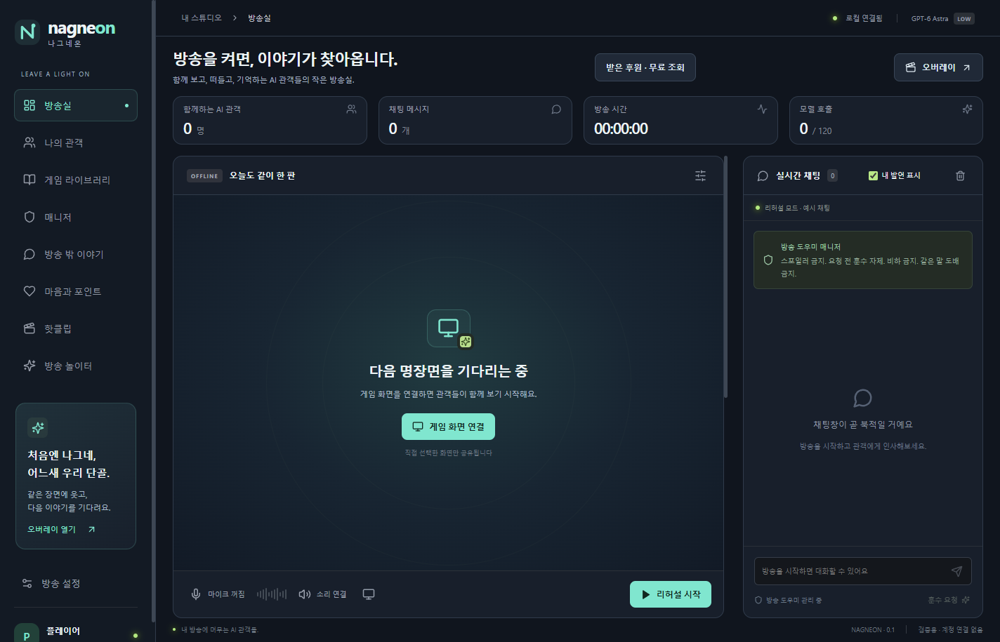

<p align="center"></p>

<h1 align="center">Nagneon · 나그네온</h1>
<p align="center"><strong>방송을 켜면, 이야기가 찾아옵니다.</strong><br />함께 보고, 떠들고, 기억하는 AI 관객들의 작은 방송실.</p>
<p align="center">Windows 데스크톱 · 한국어 대화 · AI 관객 · 로컬 기록</p>
<p align="center"><a href="#시작하기">시작하기</a> · <a href="docs/USER-GUIDE.md">사용 안내</a> · <a href="docs/DISTRIBUTION.md">배포 현황</a> · <a href="CONTRIBUTING.md">기여하기</a></p>

---

**Nagneon = 나그네 + On-air.** 우연히 들른 나그네가 어느새 익숙한 단골이 됩니다. 게임 한 판, 늦은 밤 수다, 기억에 남는 실수까지. 나그네온에서는 각자의 성격을 가진 AI 관객들과 내 방송을 만들어갑니다.

이 프로젝트는 **개인용 AI 관객 시뮬레이터**입니다. 실제 시청자를 늘리거나 외부 플랫폼에 생방송을 송출하지 않습니다. 관객·후원·커뮤니티 활동은 가상이며, 현금 결제는 없습니다.

방송을 체험하고 연습하면서 빈 방송실에서 혼자 말하는 어색함을 줄이고, AI 관객과 관계를 쌓는 게임을 지향합니다. 정해진 시즌이나 시나리오를 강제로 진행하지 않습니다. 오늘 무엇을 할지는 사용자가 정하고, 관객은 함께 본 화면과 나눈 이야기에 반응합니다. 새 프로필은 200P로 시작하며 기존 기록의 잔액은 유지됩니다.

앱 화면은 몰입을 위해 일반 방송 플랫폼의 표현을 사용합니다. 화면에 표시되는 후원과 포인트에는 현금 가치·구매·환전 기능이 없고, 관객의 속마음·취향 인터뷰는 캐릭터의 창작 대화입니다. 리허설은 준비된 채팅을 사용하며 실제 장치를 고장 내거나 게임 결과·관객 기억·후원 보상을 만들지 않습니다. 이러한 기능 설명은 이 문서와 설치 안내에서 확인할 수 있습니다.



*실제 앱 화면 · 계정과 장치를 연결하지 않은 검증용 리허설 프로필*

### 움직이는 화면 예시

아래 GIF는 실제 앱 화면에 **합성 관객·대화**를 넣은 기능 안내입니다. 다섯 장면을 각각 6초씩 보여주는 30초 안내이며, 실제 AI 응답 대기 시간이나 생성 결과를 재현한 영상은 아닙니다. 보고 싶은 항목을 열어 확인하세요.

- [첫 관객 만나기 · 30초 / 547KB](docs/images/demo-arrival.gif): 새 프로필 200P에서 50P로 만남을 열고 대화를 시작하는 흐름.
- [가상 포인트 후원 · 30초 / 680KB](docs/images/demo-donation.gif): 관객의 응원 알림과 포인트 화면. 현금 결제·환전은 없습니다.
- [공개 오버레이 · 30초 / 67KB](docs/images/demo-overlay.gif): AI 관객·가상 포인트 표시가 있는 별도 채팅창. OBS 송출 검증 영상은 아닙니다.

## 나그네들이 머무는 곳

| 공간 | 함께할 수 있는 일 |
| --- | --- |
| **방송실** | 선택한 게임 화면과 목소리를 공유하고 관객과 대화합니다. 화면 없이 Just Chatting도 가능합니다. |
| **나의 관객** | 성격·취향·게임 숙련도가 다른 관객을 만나고, 방문과 관계의 기억을 쌓습니다. |
| **채팅 오버레이** | 게임 위에 AI 채팅을 띄우고 위치·크기·투명도·클릭 통과를 조절합니다. |
| **방송 밖 이야기** | 방송 후기와 내부 농담을 나누는 로컬 가상 커뮤니티를 만납니다. |
| **AI 대시보드** | AI 실행 상태·사용량을 한곳에서 확인하고 전체 차단과 기능별 허용을 관리합니다. 방송 밖 자동 AI는 기본 차단입니다. [사용 안내](docs/AI-DASHBOARD.md) |
| **핫클립** | 함께 본 순간을 다시 꺼내보고 관객과 이야기합니다. |

## 시작하기

Windows x64 배포본은 [최신 릴리즈](https://github.com/msmckimgpt-tech/nagneon/releases/latest)에서 받을 수 있습니다. 앱 ZIP과 install-tools ZIP을 압축 해제한 뒤 설치 도구의 `INSTALL.md`를 따르세요. Node/Python 개발 도구는 필요하지 않습니다. 미서명 배포이며 자동 업데이트는 포함하지 않습니다.

앱은 무료로 공개합니다. 실제 AI 대화에 사용하는 계정·구독·사용량 조건은 선택한 AI 제공처에 따릅니다. 앱의 가상 포인트를 현금으로 구매하는 기능은 없습니다.

0.1.8 배포본은 기본 앱과 선택형 음성·GPU 구성을 나눕니다. 마이크·시스템 소리·클립·GPU 기능을 처음 사용할 때 필요한 구성과 다운로드 크기를 보여주고 설치합니다. 설치된 구성은 이후 실행과 앱 업데이트에서 재사용하며, 설치가 끝난 압축 원본은 정리합니다. 모든 기능을 설치하면 추가 공간이 필요합니다. 현재 ZIP 크기와 검증 결과는 [0.1.8 릴리즈 기록](docs/RELEASE-0.1.8.md)을 확인하세요.

### 소스에서 실행

Windows, Node.js 22 이상, Python 3.13이 필요합니다. 실제 AI 대화에는 공식 Codex CLI에서 사용할 수 있는 ChatGPT 계정이 필요합니다.

```powershell
git clone https://github.com/msmckimgpt-tech/nagneon.git
cd nagneon
npm ci
.\Setup-LocalSpeech.ps1 -Python 'python'
npm run desktop
```

이후에는 `Start-Nagneon.cmd`로 실행할 수 있습니다. 시스템 소리 분석 모델의 개발 환경 준비는 `node scripts/prepare-sound-model.mjs`를 사용합니다.

### 첫 방송까지 세 걸음

1. **내 방송을 정합니다.** 관객이 부를 이름, 방송 제목과 채팅 분위기를 고르세요.
2. **연결합니다.** 앱에서 공식 계정 로그인을 진행하거나, 준비된 예시 채팅을 보여주는 리허설로 먼저 둘러보세요.
3. **인사합니다.** 방송을 시작한 뒤 게임 화면·마이크를 선택적으로 연결하고, 키보드나 목소리로 말을 걸어보세요.

앱 실행만으로 방송이나 마이크가 시작되지는 않습니다. 실제 AI 모드는 계정의 Codex 사용량을 소비하며, 리허설은 실제 화면·음성을 AI로 인식하지 않습니다.

| 단축키 | 동작 |
| --- | --- |
| `Ctrl+Shift+F10` | 오버레이 클릭 통과 전환 |

방송을 마칠 때는 방송실의 **방송 종료** 버튼을 누르세요. 연결한 마이크·화면도 함께 종료합니다.

### 컴퓨터 사양별 관객 규모 제안

관객 수에는 앱이 정한 상한이 없습니다. 아래는 기존 PC에서 가볍게 시작할 **운영 제안**이며, 사양별 실측 성능이나 지원 인원 보증이 아닙니다. 누적 관계 수를 삭제하거나 자동으로 제한하지 않습니다.

| 현재 PC 사양 예시 | 처음 함께해 볼 관객 규모 | 함께 조정할 항목 |
| --- | --- | --- |
| 메모리 8GB · 4코어급 CPU · 내장 그래픽 | 1~5명부터 | 키보드 채팅 중심으로 시작하고 화면 공유·마이크를 하나씩 켜 보기 |
| 메모리 16GB · 6코어급 CPU | 5~15명부터 | 게임과 OBS 실행 후 메모리 여유·음성 처리 지연 확인 |
| 메모리 32GB · 8코어급 CPU | 15~30명부터 | 반응 간격·채팅 속도를 대화하기 편한 수준으로 조절 |
| 메모리 64GB 이상 · 12코어급 CPU | 30명 이상을 점진적으로 시도 | 긴 기록·많은 관객에서 UI 반응과 모델 요청 지연 확인 |

관객 AI 응답은 연결한 제공처에서 생성하므로 고사양 PC만으로 모델 응답 지연이 해결되지는 않습니다. 로컬 마이크 인식은 CPU/GPU 자원을 사용하며, 게임·OBS와 같은 GPU를 쓰면 여유가 달라집니다. [faster-whisper 공식 안내](https://github.com/SYSTRAN/faster-whisper#benchmark)의 CPU/GPU별 차이는 참고 자료이며 위 관객 수 표의 실측 근거는 아닙니다. 불편한 지연이 보이면 입력 기능과 반응 빈도를 먼저 조정하세요.

## 내 기록과 AI 연결

- **방송 설정 → 연결·사용량 → AI 제공처·관객 모델 선택**에서 모델과 추론 수준을 저장할 수 있습니다. 계정별 이용 가능 여부와 실제 비교 결과는 [관객 모델 안내](docs/AUDIENCE-MODELS.md)를 참고하세요.

### 실제 시청자가 있는 방송에서 사용하기

방송 설정에서 오버레이를 **개인용** 또는 **공개용**으로 선택합니다. 공개용은 캡처를 허용하고, AI 관객 및 가상 포인트 표시를 유지합니다. 앱의 관객 수·포인트를 플랫폼의 실제 시청자 수·금전 후원으로 소개하지 마세요. 개인용 캡처 제외는 운영체제와 캡처 방식에 따라 달라질 수 있으므로 송출 전 OBS 미리보기를 확인하세요.

OBS 창 캡처에서는 개인용으로 전환한 뒤에도 **마지막 공개 화면이 남을 수 있습니다**. 즉시 화면을 없애려면 OBS에서 해당 소스를 숨기세요. [실제 캡처 검증과 제한](docs/OBS-OVERLAY-ACCEPTANCE.md)을 확인할 수 있습니다.

AI 관객의 응답은 이전 장면이나 대화에 늦게 도착할 수 있으며, 외부 플랫폼 채팅창에는 자동으로 게시되지 않습니다. 실제 시청자와 함께 방송할 때는 공개 오버레이를 보여주거나 AI 관객의 어떤 말에 답하는지 설명해주세요. 공개 오버레이에도 지연 가능성을 표시합니다. 이 표시는 응답 속도를 개선하거나 실시간 반응을 보장하는 기능은 아닙니다.

외부 채팅을 연결하면 새 채팅 본문이 선택한 AI 제공처에 전달됩니다. 연결 전 전송 안내 확인이 필요하며, 기본적으로 작성자 이름은 연결마다 바뀌는 별칭으로 치환합니다. 닉네임 전달을 직접 선택해도 작성자 ID는 모델에 전달하지 않습니다. 채팅 본문에 작성자가 직접 적은 개인정보까지 자동으로 제거하는 기능은 아닙니다.

실제 시청자에게도 AI가 채팅을 읽는다는 사실을 안내하고 플랫폼의 관련 정책을 확인하세요. 앱의 확인란은 스트리머의 확인이며 시청자 전체의 동의를 대신하지 않습니다. 로컬 원문 버퍼는 최대 1분 뒤 또는 연결 해제 시 삭제되지만, 이미 AI 제공처에 보낸 요청까지 회수하지는 못합니다. 제공처 측 보관·이용 조건은 선택한 서비스와 계정 설정에 따라 확인해야 합니다.

### AI 연결과 로컬 기록

- 관객 기억·설정·클립은 로컬에 저장합니다. 선택한 화면 이미지, 발화 전사와 관련 대화·기억은 AI 요청에 전달됩니다. **완전한 오프라인 앱은 아닙니다.**
- 기존 로컬 모드의 마이크 전사는 로컬 Whisper로 처리합니다. 개발 중인 [원격 원음 이해](docs/NATIVE-AUDIO.md)는 별도 API 키·전송 동의·API 사용량이 필요하며, 실제 원음 수용 검증 전으로 정식 배포하지 않았습니다. 시스템 소리는 다른 앱을 포함한 Windows 출력 전체를 담을 수 있습니다.
- 마이크를 켜면 발언 복구를 위해 원음을 앱 프로필에 로컬 저장하고 24시간 뒤 삭제합니다. 복구 UI는 없으며 저장 위치와 WAV 내보내기 방법은 [마이크 원음 복구](docs/SPEECH-RECOVERY.md)에 있습니다.
- 공식 Codex CLI의 로그인 흐름을 사용합니다. ChatGPT Desktop의 비공개 인증 정보를 추출하지 않습니다.
- 여러 관객은 모델이 생성하는 서로 다른 페르소나입니다. 관객마다 별도의 모델이 실행되는 구조는 아닙니다.

저장 위치, 장치 제어와 사용량의 자세한 설명은 [사용 안내](docs/USER-GUIDE.md), 취약점 신고 방법은 [보안 정책](SECURITY.md)을 참고하세요.

## 지금 알아둘 점

화면 오독, 잘못된 훈수, 한국어 음성 인식 오류와 응답 지연이 생길 수 있습니다. 모든 게임·장치에서의 호환성과 대화의 자연스러움이 검증된 상태는 아닙니다. 실제 검증과 남은 항목은 [출시 기준](docs/RELEASE-GATES.md)과 [검증 기록](docs/VALIDATION.md)에 남깁니다.

## 함께 만들기

```powershell
npm run check
```

React + TypeScript UI, Electron 데스크톱, Express 로컬 서버로 구성되어 있습니다. 기여 방법과 작업 규칙은 [CONTRIBUTING.md](CONTRIBUTING.md)를 확인하세요. 원본 사용자 데이터와 인증 정보는 이슈·PR에 올리지 마세요.

## 라이선스

프로젝트 소스는 [MIT 라이선스](LICENSE)로 공개합니다. 수정·상업적 사용·재배포를 허용하며, 복제본 또는 소프트웨어의 상당 부분에는 원저작권 고지와 MIT 라이선스 문구를 유지해야 합니다. 출처를 쉽게 찾을 수 있도록 문서나 크레딧에 원본 저장소 링크도 함께 표기하는 것을 권장합니다. 링크·로고의 화면 표시는 별도 의무가 아닙니다. 함께 사용하는 도구·모델의 라이선스는 `third-party/`의 각 고지를 따릅니다.

<p align="center"><sub>처음엔 나그네, 어느새 우리 단골.</sub></p>

## 개발 안내

코드 흐름과 검사 명령은 [개발 안내](docs/DEVELOPMENT.md)를 참고하세요.

방송 밖 이야기의 `바깥 커뮤니티`에서 다섯 가상 공동체와 내 이야기 검색을 이용할 수 있습니다. 주민 자동활동·자연 방문은 기본 ON이며 기존 OFF와 AI 대시보드 차단은 유지합니다. 자세한 동작과 저장 형식 복귀는 [바깥 커뮤니티 안내](docs/EXTERNAL-COMMUNITIES.md)를 참고하세요.
